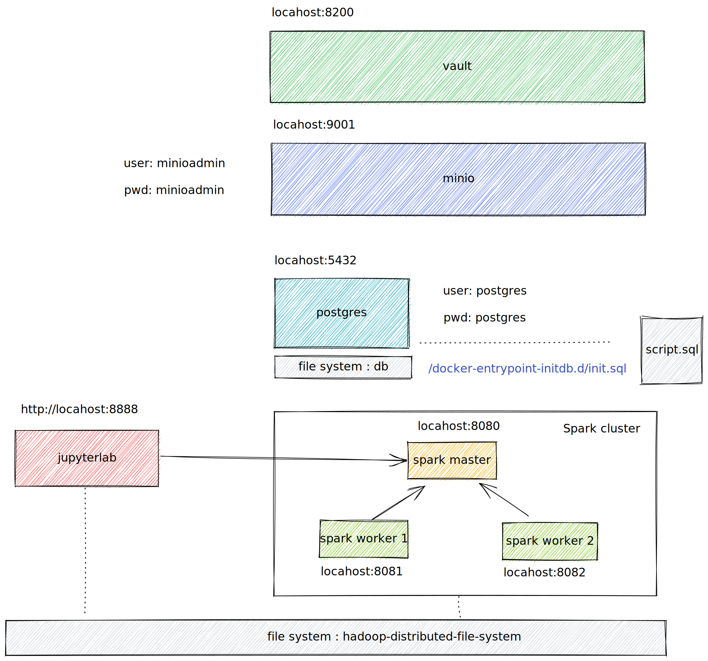
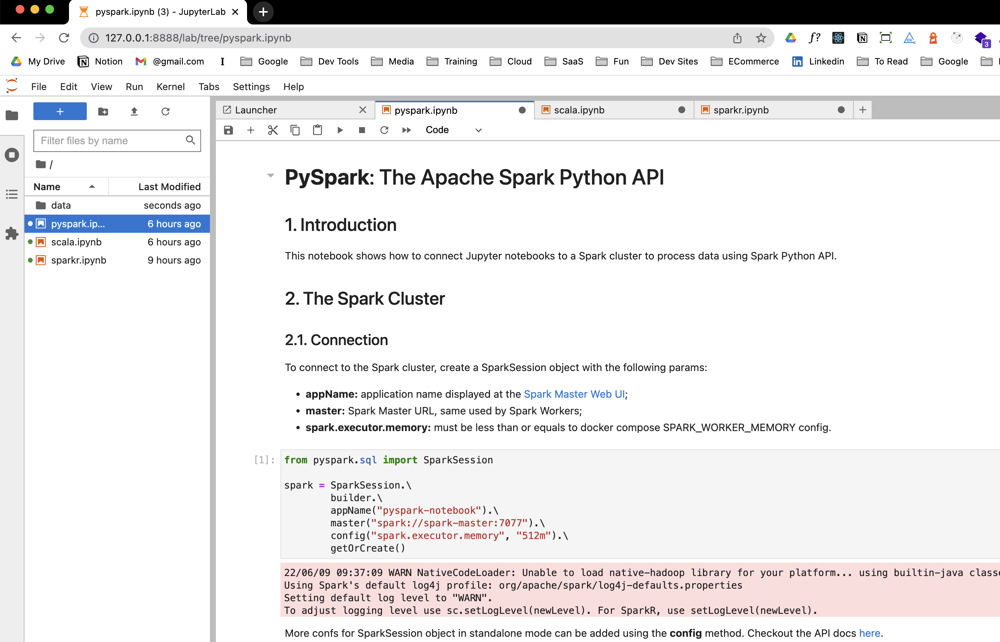

# A docker-compose with scala and spark and jupiterlab

### This recipes helps you create a local dev environment for Scala, Spark and Jupyter notebook

This project helps you to create a local stack with

- Spark
  - 1 master node
  - 2 worker
- Jupyterlab
  - Python
  - Scala
  - R
- Postgres



[Excalidraw](https://excalidraw.com/#room=89d7b8ce88bd1dc8fbdc,jJoaMBfsQHDcqN9P2KLGyw)

### Based on

- [Almond](https://almond.sh/) A Scala Kernel for Jupiter 🥜
- [Jupiterlab](https://jupyter.org/) Jupiter Lab 🪐
- [Spark](https://spark.apache.org/) Spark ⚡️

## How to start

Clone the repository

```bash
git clone https://github.com/raphaelmansuy/spark-jupyter-env-docker
```

Enter the project directory

```bash
cd spark-jupyter-env-docker
```

## Build the images

```bash
./build.sh
```

## Start the stack

```bash
docker-compose up --build
```

### The stack is running 🎉 🚀

#### Open Jupiterlab

open [http://localhost:8888](http://localhost:8888)



#### Open SparkUI

Open [http://localhost:8080](http://localhost:8080)

### Access to minio (high-performance, S3 compatible object storage)

Open [http://localhost:9001](http://localhost:9001)

🧓 user: minioadmin
🔐 password: minioadmin

## Access to vault (Secret manager)

Open [http://127.0.0.1:8200](http://127.0.0.1:8200/)

🔐 token myrootid

### To delete the stack and destroy volumes

```bash
docker-compose down --volumes
```

Voilà 🚀
