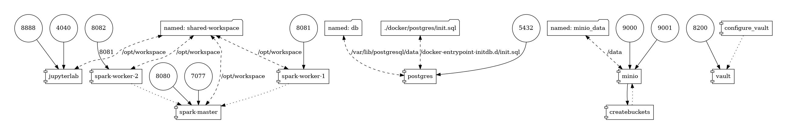

# A docker-compose with scala and spark and jupiterlab

[](https://www.codefactor.io/repository/github/raphaelmansuy/spark-jupyter-env-docker)

## A local dev environment for Scala, Spark, Jupyter notebook, vault, postgres and minio

Created with ❤️

### This project helps you to create a big data stack with

- Spark
  - 1 master node
  - 2 worker
- Jupyterlab
  - Python
  - Scala
  - R
- Postgres


#### Logical architecture


#### Detailed architecture




### Based on

- [Almond](https://almond.sh/) A Scala Kernel for Jupiter 🧠
- [Jupiterlab](https://jupyter.org/) Jupiter Lab 🪐
- [Spark](https://spark.apache.org/) Spark ⚡️
- [Minio](https://min.io/) Minio S3 compatble object storage  🏪
- [Hashicorp Vault](https://www.vaultproject.io/) A secret manager   🔐

## How to start

Clone the repository

```bash
git clone https://github.com/raphaelmansuy/spark-jupyter-env-docker
```

Enter the project directory

```bash
cd spark-jupyter-env-docker
```

## Build the images

```bash
./build.sh
```

## Start the stack

```bash
docker-compose up --build
```

### The stack is running 🎉 🚀

#### Open Jupiterlab

open [http://localhost:8888](http://localhost:8888)


#### Open SparkUI

Open [http://localhost:8080](http://localhost:8080)

### Access to minio (high-performance, S3 compatible object storage)

Open [http://localhost:9001](http://localhost:9001)

🧓 user: minioadmin
🔐 password: minioadmin

## Access to vault (Secret manager)

Open [http://127.0.0.1:8200](http://127.0.0.1:8200/)

🔐 token myrootid

### To delete the stack and destroy volumes

 💣 This instruction delete all the containers and their volumes

```bash
docker-compose down --volumes
```

Voilà 🚀
